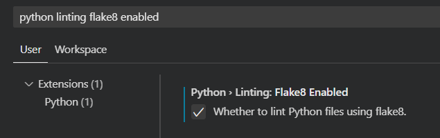

# Python Linters and Fixers

Linters and fixers are tools used to check your code for possible issues as well as make suggestions for best practice guidelines based on community standards. Linters check the code for syntax errors, community coding style recommendations, and other subtle code issues that may be difficult to detect and lead to unexpected behaviors. Fixers go a step further and actually provide automatic fixes for the issues found in your code. Using both linters and fixers in your IDE of choice will allow you to write more consistent, error free code that is easily read by others in the community.

Since this project frequently changes team members it is important the code is easy to learn quickly. These tools will be useful in ensuring that the current and future teams working on this collaborative project can quickly read and understand the code as well as remain consistent when adding new code. Below is a brief description of getting started with one linter, Flake8, and one fixer, Black.

## Installation and Configuration

Flake8 and Black are both just Python packages that can be installed using `pip` or `conda`.

```bash
# Python using pip.
pip install flake8 black

# Anaconda.
conda install flake8 black
```

Note, some IDEs may have their own version of these packages pre-installed or available via extensions and thus they do not need to be installed in to the Python environment you are using. VSCode has an official extension for Flake8.

VSCode has a fairly good set of documentation for configuring it for use with Python in general. Documentation on configuring Flake8 would be found under the [Linting] section. The Black fixer package can be found under the [Formatting] section. See below for a quick screenshot of the settings you need to enable them.

[Linting]: <https://code.visualstudio.com/docs/python/linting>
[Formatting]: <https://code.visualstudio.com/docs/python/editing#_formatting>




Most rules that both Flake8 and Black use to perform their checks can be modified, enabled, or disabled using the additional arguments passed to these tools. Most IDEs provide a way to configure these extra arguments. A common recommendation when using Flake8 and Black together is to make sure their max line length warnings are configured to the same width. These warnings for Flake8 or format rules for Black, will trigger when a code line is beyond a certain number of characters long (usually defaults to around 80 characters). To ensure Flake8 and Black are using the same line width settings or to extend them beyond ~80 characters, configure the following two settings in VSCode:


These settings can also be placed at the workspace level and checked in to the git repository, to ensure all those who work with this project are using the same linter and fixer settings. In VSCode these would be stored in a `.vscode` folder at the top of the repository using a file called `settings.json`. As long as the project members are using VSCode, these linter/fixer selections and associated settings would be automatically configured upon checkout. Other IDEs likely support similar workspace specific settings. An example of VSCodes settings file might look like the following:

```jsonc
{
    // Whether to lint Python files.
    "python.linting.enabled": true,

    // Whether to lint Python files using flake8.
    "python.linting.flake8Enabled": true,

    // Whether to lint Python files using pylint. On by default, but we want Flake8.
    "python.linting.pylintEnabled": false,

    // Provider for formatting. Possible options include 'autopep8', 'black', and 'yapf'.
    "python.formatting.provider": "black",

    // Python Linting: Flake8 Args
    "python.linting.flake8Args": [
    "--max-line-length=119"
    ],

    // Python Formatting: Black Args
    "python.formatting.blackArgs": [
    "--line-length", "119"
    ],
}
```

## Flake8

Flake8 is a Python linter that is widely supported by many IDE's and uses the [PEP8] style guide. As a quick example, consider the following code:

[PEP8]: <https://peps.python.org/pep-0008/>

```python
def print_total(total):
    if total > 0:
    total += 1
    print(f"Total: {total}")

def add_num(num1, num2):
    return num1 + num2

final_total=add_num(1, 3)
print_total(total = final_total)

```

Inside of VSCode with Flake8 set as the Python linter you would see the following:


You can see a red squiggly line under the variable name `total` on line 3. As seen above, when hovering the mouse over the red squiggly line, a tooltip pops up that explains what issue has been detected. In this case, line 3 should be indented one tab more under the `if` statement. This error causes the program to not even run due to syntax errors. Flake8 sees this and stops parsing the rest of the code, as such this appears to be the only issue at first. However, if we now fix that syntax error by indenting required lines, then save the file we will see the following:


After saving the file, Flake8 runs again to check for more errors. This time there are 3 red squiggly lines as seen above. If we hover the mouse over the variable name `final_total` on line 9 as seen below, we get the tooltip telling us it sees two issues, in this case they are style guideline warnings. The code would run just fine as it is now, but it does not follow community standard style guidelines. This could mean its harder to read by others in the community. The first warning expects there to be 2 blank lines between the function definitions (this is also the same error from line 6 seen in the image above). The second error expects there to be spaces on both sides of the equal sign for variable assignments (i.e. `final_total = add_num(1, 2)`).


The final linter error seen on line 10, as seen below, is similar to the previous spacing error, but for named parameter assignments. Here the community style guideline is to NOT have spaces around the equal sign.


## Black

Black is a Python fixer package that IDEs can use to automatically fix or format Python files according to the [PEP8] specifications. In VSCode you can configure this fixer to run automatically upon saving the file, or only when `Format Document` command is used (hotkey: `shift + alt + f`). A lot of the red squiggly lines you might see from Flake8 can likely be fixed automatically by simply running the Black fixer (or "formatter").

In the examples given in the [Flake8](#flake8) section above, this fixer wouldn't have fixed the invalid indention issue as that is a parsing error, it would however automatically fix the 4 errors detected after that parsing error was fixed. That is it would correctly fix both of the different types of "spacing errors" around the equal signs on lines 9 and 10, and would fix both "2 blank lines" errors seen on lines 6 and 9. The image below shows the original code after having the indention issue fixed and then simply pressing `shift + alt + f` (on Windows) to fix the reset of the Flake8 errors (remember to save the file afterwards so Flake8 reruns, clearing the errors).


